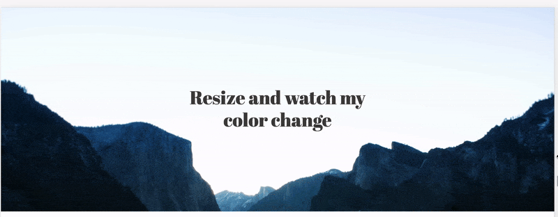

# 

This is a ESM port of Contrast.js, a tiny library with no dependencies that dynamically updates the contrast of given text based on its background image. Never worry about your color matching the background image again! No more countless media queries.



## Install

Contrast.js can be installed with [`npm`](https://www.npmjs.com/package/@victr/contrast.js)

```sh
$ npm install @victr/contrast.js
```

…and include the file in your script

```js
import Contrast from '@victr/contrast.js'
```

## Run

Add an element that has the background image and a target element, like this:

```html
<div id="background">
	<h1 id="title">Resize and watch my color change</h1>
</div>
```

Create new instance of the Contrast class, add the background and target selectors, and invoke `init()` method on it.

```javascript
import Contrast from '@victr/contrast.js'

new Contrast('#background', '#title').init()
```

Contrast also accepts options:

```javascript
import Contrast from '@victr/contrast.js'

const options = {
    once: true,              // The module runs only once; on window resize by default
    backgroundSize: 'cover', // "cover" or "contain" based on the background-size property in css
    backgroundColor: true,   // Apply contrast to background color; font color by default
    theme: {                 // If you want to prebuild light & dark colors
      light: '#bddfe0',      // Light color HEX
      dark: '#334054',       // Dark color HEX
    },
},

new Contrast('div', 'h1', options).init()
```

You can also manually update the contrast by invoking `update()` after initialization.

```js
const contrast = new Contrast('div', 'h1').init()
const button = document.querySelector('#some-button')

button.addEventListener('click', () => {
    contrast.update()
})
```

## Buy mishka a coffee

Whether you use this project, have learned something from it, or just like it, please consider supporting it by buying mishka a coffee, so that he can dedicate more time on open-source projects like this :)

<a href="https://www.buymeacoffee.com/mishka" target="_blank"></a>

## Proud to mention

Created at [Fiction Tribe ®](https://fictiontribe.com) in Portland, OR

## License

> You can check out the full license [here](https://github.com/victrme/Contrast.js/LICENSE.md)

This project is licensed under the terms of the **MIT** license.
